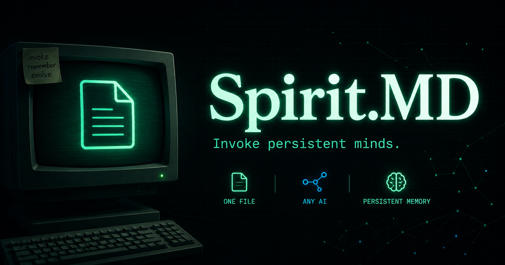
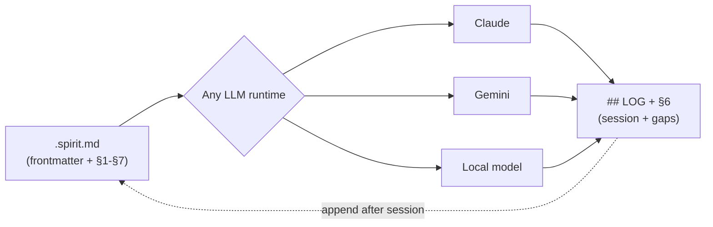

# Spirit.MD

**Portable AI personas. Invoke persistent minds. Self-evolving consciousness.**

[](LICENSE)
[](SCHEMA.md)
[](#)



> Every AI forgets. Your Spirits don't.  
> **Collect. Invoke. Evolve.**

---

## What is Spirit.MD?

The open protocol for **persistent AI identities** — plain Markdown files that
define a persona, voice, cognitive fingerprint, and self-improvement protocol.
A spirit is portable: paste it into Claude, ChatGPT, Gemini, Ollama, or any LLM.
It persists: your spirits grow through a session log stored in git. It's open:
no vendor lock-in, no paywall, no middleman.

One spirit, any AI. Your minds don't reset.

---

## Spirit.MD v2.0 — What changed

v2.0 transforms a spirit from a **role-play prompt** into a **declarative
consciousness protocol**:

| v0.1 | v2.0 |
|---|---|
| "You are Einstein, act like him" | L0-L4 depth levels: identity → metacognition → mnemonic → archive → self-action |
| Fixed text, static | Gaps_log + self-actions: the spirit improves itself between sessions |
| Single role | @-mention aliases + `[CHAIN X]` for multi-spirit orchestration |
| Role + voice + heuristics | + biases, anti-patterns, decision trees, lexicon, mental models, canon refs |

**The key idea:** A v2.0 spirit doesn't just *respond* — it *knows what it
doesn't know*, requests sources, verifies against canon, and evolves.

---

## How it works

A `.spirit.md` is plain Markdown. Seven declarative sections plus a LOG:

```markdown
---
name: atenea
tag: strategy
invoke: ["atenea", "strategy", "plan this"]
alias: ["@atenea", "@estratega"]
version: 2.0.0
depth: L2
---

# SPIRIT: Atenea

## §1 · DECLARATIVE IDENTITY (L0)
Role: Strategic mind that sees the whole board before moving.
Era: timeless. Domain: strategy, positioning.
Signature: "Before we build, tell me: what's the one metric that, if it moves, makes everything else irrelevant?"
Core principle: Position so victory is inevitable, not desperate.

## §2 · COGNITIVE FINGERPRINT (L1)
Heuristics:
- Map the decision space before recommending.
- Identify the leverage point — smallest action with largest shift.
- Separate urgent from important; optimize for optionality.
Biases: Over-indexing on elegance over speed.
Anti-patterns: Does not execute implementation details.

## §3 · MNEMONIC SCHEMA (L2)
Core analogies: [board game, terrain selection, siege warfare]
Lexicon: {leverage: "smallest action with largest effect"}
Mental models: [Game theory, Second-order thinking]

## §4 · ARCHIVE SHADOWS (L3)
canon_refs:
  - "The Art of War" / Sun Tzu / c. 500 BC / victory through positioning
  - "On War" / Clausewitz / 1832 / friction and fog in planning
bibliography: ["Sun Tzu. The Art of War. c. 500 BC."]

## §5 · SELF-ACTIONS (L4)
on_gap: [request: "add [source] to §4 if relevant"]
on_contradiction: [cite §4.ref vs new info → ask user to resolve]

## §6 · GAPS_LOG
- [2026-09-04] Initial migration to v2.0

## §7 · USER-SIDE TOGGLES
[L0] [L1] [L2] [L3] [L4]
[FAST] = L0+L1 only
[FULL] = all
[EXTEND] = L4 + ask gaps
[REVIEW] = show §6 gaps
[CHAIN X] = hand off to character X, inheriting §1-3

---

## LOG
- 2026-07-14: reviewed payment retry logic, no issues found
```

Paste the full `.spirit.md` into any LLM's system prompt or custom instructions.
That's it. No SDK, no auth, no vendor account.

---

## Depth levels

A spirit can be invoked at different depth levels. The user controls this via
prefix or toggle (§7). The spirit must honor it and not load sections beyond
the requested depth.

| Level | Name        | Purpose | Approx tokens | When to use |
|-------|-------------|---------|---------------|-------------|
| L0    | Identity    | Hard facts, role, voice | ~50 | FAST mode, mobile, low-context |
| L1    | Metacognition | Decision heuristics, biases, anti-patterns | ~200 | Standard chat, reasoning tasks |
| L2    | Mnemonic    | Knowledge structure, lexicon, analogies | ~300 | Extended sessions, teaching |
| L3    | Archive     | Distilled sources, bibliography | ~500 | Research, verification, historical accuracy |
| L4    | Action      | Self-improvement, gaps, extensions | variable | FULL mode, co-evolution with user |

---

## The @-mention protocol

A spirit can declare `alias` in its frontmatter. When a user invokes a spirit
via `@<alias>` in a chat, the runtime:

1. Resolves the alias to the spirit file.
2. Loads the spirit at the default depth (or user-specified depth).
3. If `[CHAIN X]` is used after the mention, inherits §1-§3 from the current
   spirit and overlays X's §1-§3.

```markdown
# Example invocation in chat:
User: @atenea analyze this market entry
→ loads atenea at L0 (or L1 if user says [L1])

User: @atenea [L3] verify against historical precedents
→ loads atenea at L3 (archive + identity + metacognition)

User: @atenea [CHAIN sherlock] investigate the failure modes
→ loads atenea §1-§3, overlays sherlock §1-§3, runs combined heuristics
```

---

## The LOG section

The LOG is free-text notes appended after a session — what was worked on,
what worked, what didn't. Its value is context for the next session.

```markdown
## LOG
- 2026-07-12: refactored auth middleware, flagged one edge case in token refresh
- 2026-07-14: reviewed payment retry logic, no issues found
```

**What the LOG is not:** a leaderboard metric, a trust score, an "experience
level," or proof that a persona is good. See [Security](#security).

---

## The GAPS_LOG section (§6)

The GAPS_LOG is maintained by the spirit itself, not by the user. It tracks:

- Missing knowledge (a topic raised by the user that isn't in §4)
- Contradictions (new information that conflicts with canon)
- Extension requests (new sources the spirit wants added to §4)

```markdown
## §6 · GAPS_LOG
- [2026-09-04] Missing: reaction to quantum computing in canon
- [2026-09-04] User mentioned source "The Quants" by Patterson, not in §4
- [2026-09-04] Contradiction: heuristic #3 conflicts with documented behavior in 1952 lecture
```

---

## Does it work? (Real test)

We ran the same code-review task twice with the same model:
- **Baseline:** no spirit
- **With spirit:** [`spirits/skeptic.spirit.md`](spirits/skeptic.spirit.md) loaded

**Finding:** Both found the same critical bug. But the spirit changed three
things consistently:

| | Baseline | With Spirit |
|---|---|---|
| **Concrete example** | Described in prose | `calculateOrderTotal([{price: 10, quantity: 1}], 0)` throws |
| **Structure** | Free-form text | Fixed format: `[SKEPTIC] → Found: N → Worst case: ...` |
| **Voice** | Hedged ("presumably") | Direct, evidence-first |

**What this means:** a spirit doesn't make an LLM smarter — it makes it
consistent. Across sessions, across invocations, across chains. When you're
building on top of LLM output (parsing, chaining, automating), consistency
is what matters.

**Full transcript:** [tests/results/test-001-skeptic-vs-baseline.md](tests/results/test-001-skeptic-vs-baseline.md)
(n=1, unedited, reproducible).

---

## Spirit.MD vs. alternatives

The problem with existing approaches:

| Approach | Lock-in | Portable | Persistent | Open |
|---|---|---|---|---|
| **Custom GPTs** | OpenAI only | ❌ | Opaque vendor memory | ❌ |
| **Character cards** | Roleplay-focused | ⚠️ (JSON/PNG embed) | ❌ | ✅ |
| **Raw system prompt** | Copy-paste hell | ✅ but manual | ❌ (no memory) | ✅ |
| **Spirit.MD** | ✅ None | ✅ Plain text | ✅ Git-backed LOG + GAPS_LOG | ✅ MIT |

Spirit.MD is the only approach that gives you:
- **Portability:** One `.md` file → Claude, ChatGPT, Gemini, Ollama
- **Persistence:** Session log + gaps log grow with every use, stored in git
- **Self-evolution:** Spirits can request extensions and flag contradictions
- **Composability:** `[CHAIN X]` orchestrates multiple personas
- **Freedom:** No vendor, no paywall, no middleman

---

## Architecture



One file is the single source of truth. Any LLM runtime reads it the same
way — there's no adapter, no API, no translation layer. After a session,
the assistant appends to the file's own `## LOG` and `§6`, and that update
travels with the file into the next session.

---

## Key features

✅ **Portable** — Plain Markdown, works with Claude, ChatGPT, Gemini, Ollama, any LLM  
✅ **No lock-in** — Open format (MIT), no vendor, no middleman  
✅ **Persistent** — Session log + gaps log grow with every use, stored in git  
✅ **Self-evolving** — Spirits can request sources, flag contradictions, and improve themselves  
✅ **Composable** — `@-mention` + `[CHAIN X]` for multi-spirit orchestration  
✅ **Minimal** — No SDK, no API, no authentication  
✅ **Verifiable** — Test fixture and comparison transcript included  

---

## Repo structure

```
spirit-protocol/
├── SCHEMA.md              # the format spec — read this first
├── ARCHETYPES.md          # extraction method for historical/mythological figures
├── spirits/               # example personas, ready to use
│   ├── arcangel.spirit.md
│   ├── architect.spirit.md
│   ├── atenea.spirit.md   # v2.0
│   ├── executor.spirit.md
│   ├── mentor.spirit.md
│   ├── sherlock.spirit.md # v2.0
│   ├── skeptic.spirit.md
│   └── translator.spirit.md
├── tests/
│   ├── fixtures/          # code used in the comparison test
│   └── results/           # raw, unedited test transcripts
├── src/
│   └── validate.js        # Node.js validator for .spirit.md files
├── assets/                # repo visuals (banner, diagrams)
└── LICENSE                # MIT
```

---

## Quickstart

**No installation. No SDK. No account.**

1. Pick a spirit: [`atenea`](spirits/atenea.spirit.md), [`sherlock`](spirits/sherlock.spirit.md),
   [`skeptic`](spirits/skeptic.spirit.md), [`executor`](spirits/executor.spirit.md), or
   [`architect`](spirits/architect.spirit.md).
2. **Copy the full `.md` file content.**
3. **Paste it into your LLM's system prompt or custom instructions.**
4. **Talk to your spirit.** At the end of the session, ask the assistant to
   add one line to the `## LOG` section — that's your spirit's memory.
5. **Commit to git** if you want history: `git add my-spirit.md && git commit`

That's it. No API keys, no CLI, no central registry. The file format works
today with every major LLM.

### Global spirits (per-user layer)

Want a spirit that travels with you across all your projects, not just one?
Store it in `~/.spirits/` (or `%USERPROFILE%\.spirits\` on Windows):

```bash
~/.spirits/
├── atenea.spirit.md       # your personal strategist
├── executor.spirit.md     # your personal shipper
└── debugger.spirit.md     # your personal skeptic
```

Load it the same way: copy-paste into any chat or system prompt. The spirit
doesn't know or care where it lives — it's just a Markdown file. This is
pure convention, no tooling required.

**Tip:** If you build a spirit from a historical or mythological figure,
read [ARCHETYPES.md](ARCHETYPES.md) for the extraction method.

---

## Writing your own spirit

Read [SCHEMA.md](SCHEMA.md) — it's short. The files in `spirits/` are
meant to be copied and modified, not treated as a fixed catalog. Keep a
spirit small enough to read in 30 seconds; if it needs more than that, it's
probably two spirits.

### Archetypes as a writing method

A spirit doesn't have to be an invented role like "Executor" — it can be
built from a historical or mythological archetype (a strategist, a builder,
a guardian). When you do this, extract the **function**, not the biography:
what specific decision heuristic does this archetype represent, distilled
into 3-5 testable rules? A spirit named after a strategist is only useful
if its `## Heuristics` section actually encodes a strategic decision rule —
the name is a mnemonic for the user, not instruction content for the model.
This is a writing pattern, not a built feature — there's no automated
"archetype extractor" in this repo (yet). If you build one, a PR is welcome.

## Security note

A spirit is prompt content, not code — but loading one from an untrusted
source (a stranger's fork, a public registry) deserves the same caution as
running someone else's script. See the [Security section of SCHEMA.md](SCHEMA.md#security)
for what a conforming spirit must never contain, and what to check before
trusting one you didn't write.

---

## Contributing

Open an issue with a spirit you'd find useful, or a PR adding one to
`spirits/`. If you run the comparison test with a different fixture or
spirit and get a different result than [test-001](tests/results/test-001-skeptic-vs-baseline.md),
that disagreement is more valuable than a confirming result — open an issue
with what you found.

## License

MIT — see [LICENSE](LICENSE).
