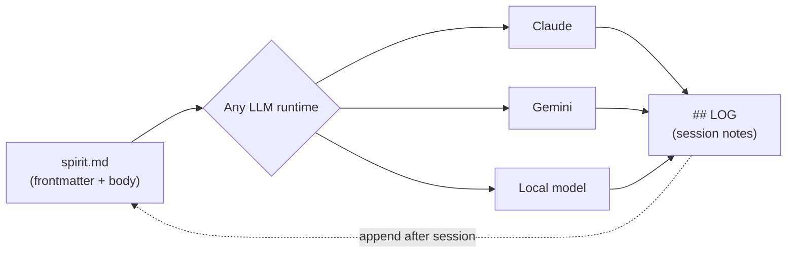

# Visual assets — AI image generator prompts

Ready-to-paste prompts for this repo's visuals (Midjourney, DALL-E 3,
Ideogram, Stable Diffusion, or similar). Written in English — image models
follow English prompts most reliably regardless of your own language.

**Important limitation to plan around:** AI image generators are unreliable
at rendering small, readable text (labels, multi-word captions, code).
Ideogram and DALL-E 3 are the best of the bunch for short text (1-4 words),
but for anything with real labels — the conceptual map, the comparison
chart — generate the **background/style only** with AI, then add the actual
text as a layer in Figma, Canva, or plain HTML/SVG. Trying to get an image
model to render "invocations: 10" legibly inside a terminal mockup will
waste more time than it saves.

---

## 1. Repo thumbnail / social card (og:image)

Used for link previews on Twitter/X, LinkedIn, Slack. GitHub's own
social-preview slot is also this size.

**Size:** 1200×630px

**Prompt:**
```
A minimal dark-theme tech illustration, GitHub-style dark background
(#0d1117), a single glowing document/file icon at center with a soft green
aura (#238636), three thin light-blue (#58a6ff) connection lines radiating
outward from the file to three simple abstract node shapes at the edges of
the frame, representing different AI systems without depicting any real
logos or brand marks. Clean geometric style, subtle grid texture in the
background, generous negative space, no text, no human figures, flat
vector-illustration aesthetic similar to modern developer-tool marketing
sites (Vercel, Linear, Raycast). 16:9 aspect ratio.
```

**Negative prompt (if supported):** `text, letters, words, logos, brand marks, faces, people, photorealistic, clutter`

**After generating:** add the title text ("spirit-protocol") and tagline
as a separate typography layer — don't rely on the model to render it.

---

## 2. "How it works" infographic — 3-step flow

Explains: write a spirit → load it in any LLM → session log accumulates.

**Size:** 1600×900px (widescreen, works in README embed)

**Approach:** Generate three separate simple icon/scene illustrations (below),
then compose them into a 3-panel layout yourself in Figma/Canva/HTML — do
not ask the model to generate the full 3-panel infographic with text in one
shot; composition and labels will come out garbled.

**Panel 1 prompt — "Write":**
```
A minimal dark-theme icon illustration, flat vector style, a single markdown
document icon with visible simple line-marks suggesting text (not readable
text, just texture), soft green glow (#238636) around the edges, dark
background (#0d1117), centered composition, no text, no logos.
```

**Panel 2 prompt — "Load anywhere":**
```
A minimal dark-theme icon illustration, flat vector style, one document icon
at the center with three thin light-blue (#58a6ff) arrows branching outward
to three simple abstract rounded-square nodes of equal size at the corners,
symmetric composition, dark background (#0d1117), no text, no real logos or
brand marks, clean geometric shapes only.
```

**Panel 3 prompt — "Log grows":**
```
A minimal dark-theme icon illustration, flat vector style, a simple terminal
window shape with abstract horizontal line-marks suggesting a scrolling
log (not readable text), a small upward arrow or ascending bar-chart motif
beside it in soft green (#238636), dark background (#0d1117), centered,
no readable text, clean geometric shapes only.
```

Compose the three panels left-to-right with your own arrows and captions
("1. Write" / "2. Load anywhere" / "3. Log grows") added afterward.

---

## 3. Conceptual map — architecture diagram

Shows: `.spirit.md` file → frontmatter + body + log → consumed by any LLM
runtime. **Recommendation: build this one as an actual diagram (Mermaid,
Excalidraw, or plain SVG), not an AI-generated image** — a real diagram
tool will render the labels correctly and stay editable when the schema
changes, which an AI-generated PNG can't. A Mermaid version:



If you still want an AI-generated **background texture** to sit behind a
hand-built diagram (for a hero/banner version), use:

```
An abstract technical background texture, extremely subtle circuit-board /
node-graph pattern in dark tones, background color #0d1117, faint line
connections in muted gray with occasional soft green (#238636) and light
blue (#58a6ff) accent nodes, very low contrast so text and diagrams overlaid
on top remain fully readable, no text, no recognizable objects, abstract
only. 16:9 aspect ratio.
```

---

## 4. Comparison chart visual style (spirit.md vs. alternatives)

The actual chart (the Markdown table already in the README) should be built
as a real chart/table, not an AI image — table data needs to stay accurate
and editable. If you want a **styled visual version** for social sharing,
generate a background/frame only:

```
A minimal dark-theme card/panel background suitable for overlaying a
comparison table, background color #0d1117, a subtle rounded-rectangle
panel with a thin border in muted gray, soft green (#238636) accent line
at the top edge, clean and empty in the center for text/table overlay,
no text, no icons, flat design, generous padding, 4:3 aspect ratio.
```

Then add the real table data as text/HTML on top — never let an image model
generate numbers or comparison claims, since it will hallucinate values.

---

## 5. Favicon / small icon

**Size:** 512×512px (scale down after)

**Prompt:**
```
A simple, bold, minimal icon: a single stylized document/file shape with a
small flame or spark glowing at its top-right corner, two-color palette
only (dark background #0d1117, soft green #238636 accent), flat vector
style, no gradients, no text, must remain legible at 32x32px, centered,
generous margin around the shape.
```

---

## General style keywords to reuse across all prompts

Keep these consistent so every generated asset feels like one system:

- **Palette:** background `#0d1117`, primary accent `#238636` (green), secondary accent `#58a6ff` (blue), text/lines in muted gray `#8b949e`
- **Style:** flat vector illustration, minimal, geometric, developer-tool aesthetic (think Vercel/Linear/Raycast marketing sites, not sci-fi or fantasy art)
- **Avoid:** photorealism, human faces, real product logos, readable text baked into the image, clutter, gradients that clash with the flat-design look

## Tools that render text reliably (use these instead of AI image-gen for anything with labels)

- **Diagrams:** Mermaid (renders natively in GitHub READMEs — no export needed), Excalidraw, or [tldraw](https://tldraw.com)
- **Social cards / thumbnails with text:** Figma, Canva, or a simple HTML template rendered to PNG (Puppeteer/Playwright screenshot)
- **Charts:** the Markdown table in the README is already the source of truth — don't fork the data into an image
